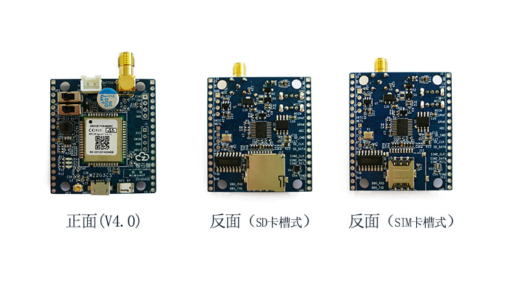

# [MT2503](https://github.com/SoCXin/MT2503)

* [MediaTek](https://www.mediatek.com/): [ARM7EJ-S](https://github.com/SoCXin/Cortex)
* [L5R4](https://github.com/SoCXin/Level): 260 MHz

## [简介](https://github.com/SoCXin/MT2503/wiki)

[MT2503](https://github.com/SoCXin/MT2503) 平台是GSM平台MT6261和GNSS平台MT3333的组合体。其在面积缩小40%、功能大大增加的同时，性能也有很大程度的提高。

### 关键特性

* 2G modem
* BeiDou,  Galileo,  GPS+GLONASS
* BT 2.1+EDR,3.0

### [资源收录](https://github.com/SoCXin)

* [参考资源](src/)
* [参考文档](docs/)
* [参考工程](project/)

### [选型建议](https://github.com/SoCXin)

[MT2503](https://github.com/SoCXin/MT2503) 支持openCPU开发，可以获得相关SDK资源

* TFBGA 5.4 x 6.2 mm

#### 相关开发板

### [探索芯世界 www.SoC.xin](http://www.SoC.Xin)
